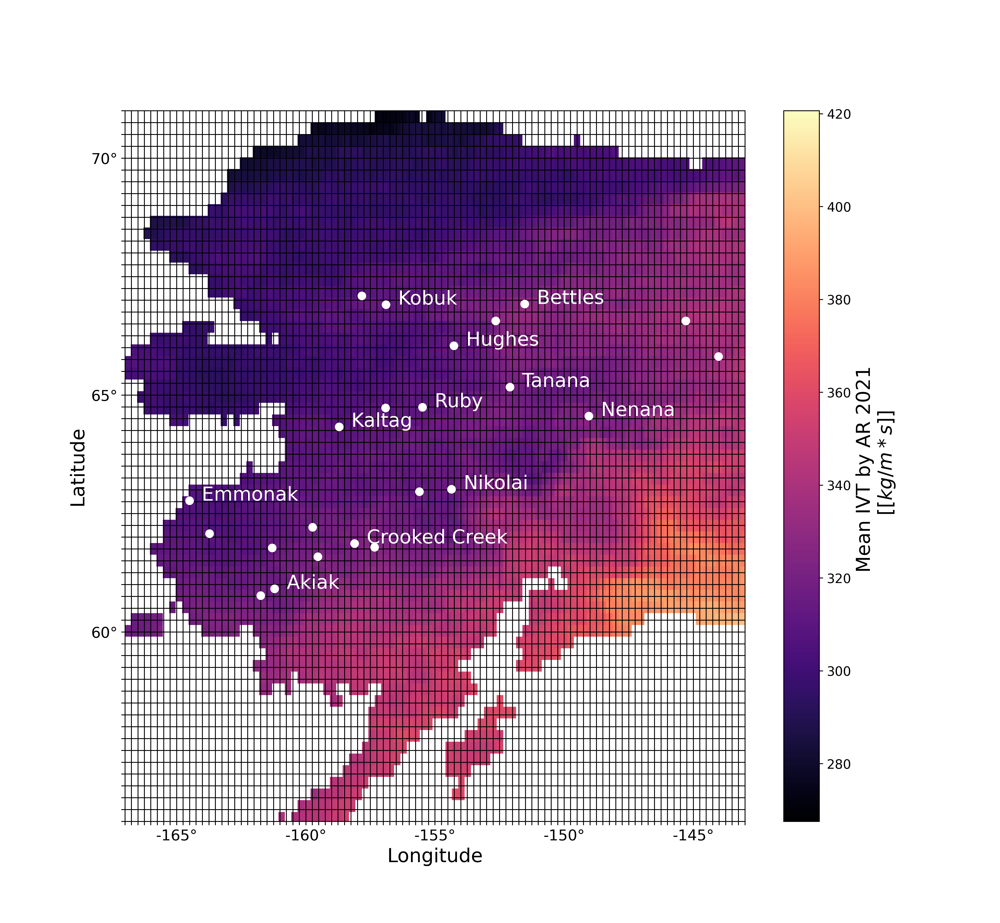
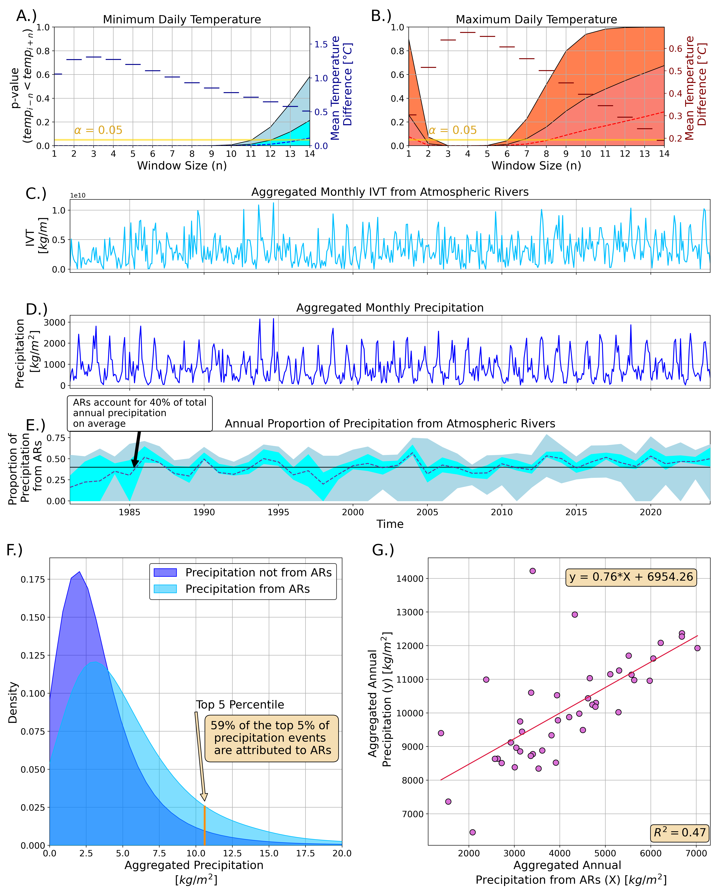
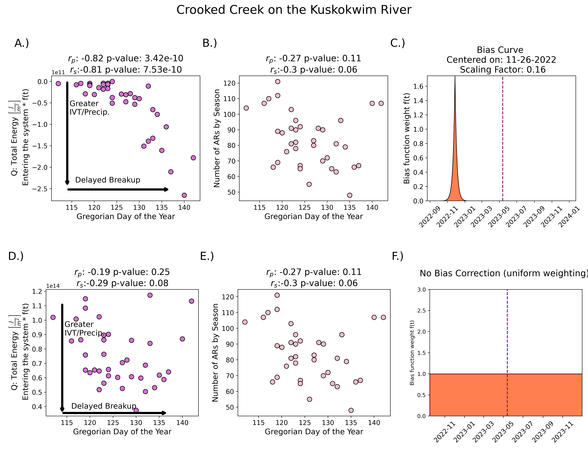

# Influence of Atmospheric Rivers on Alaskan River Ice

## Abstract

Amospheric rivers (ARs) transport vast amounts of moisture from low to high latitude regions. One region particularly impacted by ARs is Interior Alaska (AK). We analyze the impact of ARs on the annual river ice breakup date for 26 locations in AK. We investigate the AR-driven rise in local air temperatures and explore the relationship between ARs and precipitation, including extremes and interannual variability. We found that AR events lead to an increase in local air temperatures for over one week (by ≈ 1 °C). ARs account for 40% of total precipitation, explain 47% of precipitation variability, and make up 59% of extreme precipitation events, each year. By estimating the heat transfer between winter precipitation and the river ice surface, we conclude that increased precipitation during the coldest period of the year delays river ice breakup dates, while precipitation occurring close to the breakup date has little impact on breakup timing.

---

## Data

The river ice breakup dates for each site were collected from the [Alaska-Pacific River Forecast Center](https://www.weather.gov/aprfc/); the daily meteorological data at a 1km by 1km spatial resolution were imported from Daymet using the [Daymet pixel extraction tool](https://daymet.ornl.gov/single-pixel/) maintained by Oak Ridge National Laboratory; atmospheric river detection is based on version 4 of the tARget algorithm ([Guan & Waliser, 2024](https://doi.org/10.1038/s41597-024-03258-4); [Guan, 2024](https://doi.org/10.25346/S6/SF4AFW)).




---

## Results

We demonstrate using paired t-tests that the occurrence of an AR in Alaska can impact the daily minimum and maximum temperatures (particularly the minimum temperature) for varying time windows. We also discovered through exploratory analysis that ARs make up 40% of total precipitation, account for 59% of extreme precipitation events (top five percentile), and explain 47% of interannual variability of precipitation, throughout Alaska.



We note a strong inverse correlation between the approximated energy exchange between the river ice surface with precipitation and the Gregorian day of the year the breakup occurred:



---

## Publication

This work was published in *Geophysical Research Letters*, an American Geophysical Union journal, in the special edition: **Integrating In Situ, Remote Sensing, And Physically Based Modeling Approaches to Understand Global Freshwater Ice Dynamics**.

---

## Acknowledgment

This work was supported by the U.S. Department of Energy, Office of Science, Biological and Environmental Research (BER) Regional and Global Model Analysis (RGMA) program, as part of The Interdisciplinary Research for Arctic Coastal Environments (InteRFACE) project. Development of the AR database was supported by NASA and the California Department of Water Resources. This manuscript has been authored in part by UT-Battelle, LLC, under contract DE-AC05-00OR22725 with the US Department of Energy (DOE). The publisher acknowledges the US government license to provide public access under the DOE Public Access Plan (http://energy.gov/downloads/doe-public-access-plan).

---

## How to Cite

If you use this work or the provided code, please cite:

**Bibtex**:
```bibtex
@article{Limber2024,
	author = {Limber, Russ and Massoud, Elias C. and Guan, Bin and Hoffman, Forrest M. and Kumar, Jitendra},
	title = {Influence of Atmospheric Rivers on Alaskan River Ice},
	journal = {Geophysical Research Letters},
	volume = {51},
	pages = {e2024GL111544},
	keywords = {River Ice, Alaska, Atmospheric Rivers, Precipitation, Daily Temperature, River Ice Breakup},
	doi = {10.1029/2024GL111544},
	url = {https://doi.org/10.1029/2024GL111544},
	year = {2024}
}
```

```
Limber, R., Massoud, E. C., Guan, B., Hoffman, F. M., & Kumar, J. (2024).
Influence of atmospheric rivers on Alaskan river ice. Geophysical Research Letters,
51, e2024GL111544. https://doi.org/10.1029/2024GL111544
```
